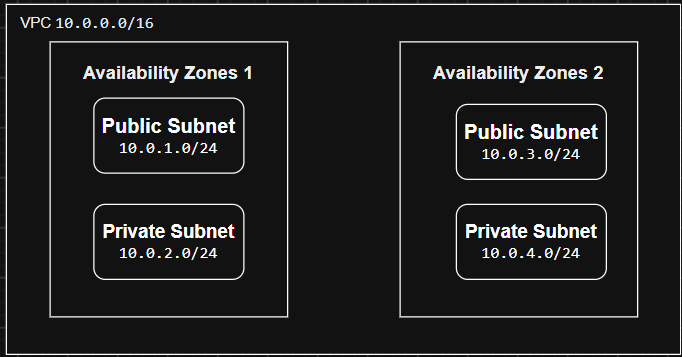

# 1, Thiết kế sơ đồ 1 VPC chuẩn tối thiểu gồm Public Subnet và Private Subnet trải dài trên 2 Availability Zones (AZs).

# Giải thích nguyên lý cô lập mạng (Network Isolation):
#    Tại sao Database hoặc Application Server lại bắt buộc phải đặt trong Private Subnet?
        Database chứa dữ liệu cốt lõi ví dụ thông tin người dùng, mật khẩu, dữ liệu ứng dụng. Do đó Database và Application Server đặt trong Private Subnet để chúng không bị Internet truy cập trực tiếp. Người dùng chỉ truy cập Web Server ở Public Subnet, sau đó Web Server mới gọi Application Server và Application Server truy cập Database. Nhờ vậy, nếu Web Server gặp vấn đề thì Database vẫn có thêm một lớp mạng bảo vệ.
#    So sánh sự khác nhau giữa Security Group và NACL khi chặn/mở traffic (Nêu ví dụ cụ thể về Stateful vs Stateless).
        Security Group: Áp dụng cho từng tài nguyên như EC2, chỉ cho phép các traffic được quy định và có tính Stateful, nên traffic phản hồi của một kết nối đã được cho phép sẽ tự động được chấp nhận.
        Network ACL: Áp dụng cho toàn bộ Subnet, có thể cho phép hoặc chặn traffic và có tính Stateless, nên traffic vào và traffic ra phải được cấu hình riêng.
#       VD: 
        Stateful (Security Group): Khi máy khách được phép gửi yêu cầu đến server qua cổng 443, server có thể gửi phản hồi lại máy khách mà không cần tạo thêm rule riêng cho chiều phản hồi.
        Stateless (NACL): Khi NACL cho phép máy khách gửi yêu cầu đến server qua cổng 443, phải có thêm rule cho phép traffic phản hồi từ server trở lại máy khách; nếu không, phản hồi có thể bị chặn.